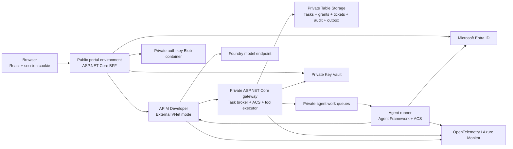

## Scope and evidence

Research date: 2026-10-08. Requirements are based on the supplied Project 1
excerpt and subsequent design choices. The protected source PDF was not
extracted or copied into this project.

The MVP uses two autonomous agents, two synthetic ticket tools, one tenant,
one gateway, one policy bundle, and one trusted task/approval control plane.
Only `tickets.read` and `tickets.set_priority` exist. The latter changes a
synthetic ticket, not a real customer or cloud resource.

Further research adds a React ticket dashboard, a same-origin ASP.NET Core
BFF, and durable asynchronous task execution. The UI covers ticket browsing,
agent task submission, human approvals, and sanitized decision history.
Full ticket CRUD and chat-first interaction are excluded.

Confirmed demo choices allow requester self-approval and re-sign-in after a
single-replica portal restarts. See the
[UI and workflow design](./ui-and-workflow-design.md) for the detailed screens,
authentication contracts, role matrix, dispatch/resume flow, and sources.

Use real Entra Agent ID and API Management in the Azure demo. Fast tests can use
controlled identity fixtures, but must not be presented as evidence that real
Entra integration works.

## Recommended technology choices

| Component                 | Recommendation                                                   | Reason                                                        |
|---------------------------|------------------------------------------------------------------|---------------------------------------------------------------|
| Application               | ASP.NET Core on a supported .NET LTS, targeting .NET 10           | Typed APIs, authorization middleware, and native identity SDKs |
| Agent orchestration       | Microsoft Agent Framework                                        | .NET support and interceptable model/tool execution            |
| Model                     | A small Foundry-hosted model supporting tool calling              | Real agent behavior without making the model an authorizer     |
| Agent identity            | Entra Agent ID blueprint and two child identities                 | Distinct principals, grants, attribution, and revocation        |
| Token acquisition         | `Microsoft.Identity.Web.AgentIdentities` with managed identity/FIC | Supported autonomous flow without hand-written token exchange  |
| Portable governance       | Native `AgentControlSpecification` .NET SDK and Rego policies     | ACS lifecycle snapshots, normalized verdicts, and portability   |
| ACS framework adapter     | `AgentControlSpecification.AgentFramework`                        | Wraps real `Microsoft.Agents.AI.AIAgent` instances               |
| API gateway               | Classic API Management Developer, external VNet mode              | Public authenticated API ingress and private backend access    |
| Ticket UI                 | React + TypeScript, Vite, and community Material UI components     | Focused ticket/task/approval dashboard                          |
| Browser backend           | Same-origin ASP.NET Core BFF with Microsoft.Identity.Web           | Human sign-in and delegated API tokens kept server-side        |
| Portal hosting            | Separate public, VNet-integrated Container Apps environment        | Reachable UI without exposing the private executor             |
| Backend hosting           | Container Apps with an internal, VNet-integrated environment      | Private HTTP backend and managed workload identities           |
| Grant, ticket, audit state | Azure Table Storage with Entra authentication                     | Durable state, ETag concurrency, and same-partition batches     |
| Task dispatch              | Table outbox, Queue Storage, and event-driven agent jobs           | Durable submission and approval resume without open HTTP calls |
| Portal key ring            | Private Blob container and Key Vault wrapping key                 | Persistent Data Protection keys, separate from the token cache |
| Secret boundary           | Key Vault Standard with RBAC and private access                   | Any necessary secret is outside configuration and source       |
| Observability             | OpenTelemetry and Azure Monitor/Application Insights              | Correlated gateway, ACS, authorization, and execution evidence  |
| Infrastructure later      | Bicep and separate Entra provisioning automation                   | Reproducible resource setup without hiding Graph consent steps  |
| CI later                  | GitHub Actions with federated Azure credentials                   | No long-lived deployment credentials                           |

Key Vault is not a reason to introduce API keys. Prefer managed identity and
federation throughout. If the demo has no genuine secret, deploy/configure the
vault as a least-privilege security boundary without inventing one.

Dapr Agents, multiple agent frameworks, AKS, MCP, semantic caching, and a
standalone production policy service are not needed for the first MVP.
Native MCP can be added later; REST tools are easier to constrain and test.

## Reference architecture



Use separate subnets for APIM, public portal infrastructure, private Container
Apps infrastructure, and private
endpoints. APIM's public gateway is deliberate; the tool backend must have
no public ingress. External VNet mode avoids requiring a VPN for the demo.
Do not describe this as an entirely private front door.

The public portal is a second deliberate public entry point. It serves React
assets and human sign-in/session endpoints; its business calls still pass
through APIM. Use separate public and internal Container Apps environments.
An internal environment cannot become a public portal merely by changing its
app ingress setting.

The BFF has no ticket/grant Table access, blueprint credentials, APIM transport
identity, queue publishing rights, or direct tool handler access. Its managed
identity is restricted to confidential-client federation and its own auth-key
Blob/Key Vault boundary. Human browsing uses separately authorized human APIs;
it neither consumes an agent grant nor permits direct ticket mutation.

For an internal Container Apps environment, the gateway app needs ingress
reachable from APIM through the VNet, not ingress restricted only to other apps
inside that environment. Verify the actual environment and app ingress settings
with a request from APIM and a denial from the public internet.

Keep the trusted gateway/task broker separate from the agent workload and its
managed identity. The agent cannot write grants, change policies, read Key Vault,
write the ticket store directly, or approve its own requests.

The two tool implementations can initially share the trusted gateway process.
This keeps the final authorization check adjacent to execution and avoids an
unnecessary downstream authorization protocol. The model-facing process must
never have a direct in-process reference to the ticket mutation handler.

## Identity and token contracts

### Agent identity versus hosting identity

The Container Apps managed identity is a credential for the blueprint's
federated flow. It is not a replacement for the distinct agent identity.

Provision a blueprint, its blueprint principal, and two child identities.
Acquire resource tokens with Microsoft's autonomous agent flow using the
identity SDK. The protocol uses a blueprint exchange token and `fmi_path`,
then a resource token for the child agent. Do not hand-build a generic RFC 8693
exchange or assume `DefaultAzureCredential` alone returns an Agent ID token.

Grant each child only the coarse custom API application role `Agent.Invoke`.
That role permits reaching the tool invocation route; it grants no ticket
permissions. The agent runtime needs no broad Microsoft Graph data permissions.
Administrative provisioning and consent use separate, privileged credentials.

### Claims and authorization boundaries

Validate the signature, trusted issuer, tenant, audience, expiry, and token
version before reading claims. For the autonomous scenario:

* Use validated `tid` plus `oid` as the principal key.
* Record `azp` or `appid`, according to token version.
* Confirm the principal is an enrolled child agent, not merely any application.
* Use documented agent facets as additional evidence, where present.
* Treat `xms_par_app_azp` as audit context, not a permission shared by siblings.
* Do not assume `sub`, the blueprint application ID, and the child object ID are interchangeable.

Current Microsoft Learn documents a v1.0 create operation for Agent ID while
some scenario guides still show beta endpoints. Use the operation-specific
Graph reference and pin the provisioning API version. Do not blanket-label
every Agent ID operation as beta or copy older setup examples without checking.

### Gateway-to-backend identity

APIM validates the caller's Entra token with `validate-azure-ad-token`.
It then authenticates to the private backend with its own managed identity
using `authentication-managed-identity`, with errors not ignored.

Because that policy replaces `Authorization`, deliberately preserve the
original caller token in a dedicated internal header. APIM must overwrite
any client-supplied version of that header, and the backend must independently
validate both tokens:

1. The transport token must identify APIM and carry `Gateway.Forward` for the backend audience.
1. The caller token must identify the allowed agent or authorized human for the gateway audience.
1. The backend derives the principal from the caller JWT, never an unsigned identity header.

Never log either token. Forward them only to the fixed trusted backend.
An APIM subscription key, a trace ID, or a caller-supplied `agent_id` is not an
authorization credential. Restrict APIM policy editing because editors can
exercise the gateway's managed identity.

Use different application registrations/audiences for the public gateway API
and private transport API. Human operator and approval routes require delegated
access from the operator client plus the relevant human role. An app-only agent
token must fail on these routes.

The primary human client is now the ASP.NET Core BFF app registration.
It acquires delegated gateway tokens for the signed-in user through
Microsoft.Identity.Web; React receives no access/refresh token.
An optional CLI remains a diagnostic client, not the required operator UI.

## Task-scoped permissions and approval

Use a server-side grant record and an opaque grant handle, rather than creating
and deleting Entra app roles for every task. Entra access tokens authenticate
the principal; the gateway record expresses expiring task authorization.
Deleting a grant or waiting for OAuth expiry is not an instant revocation design.

A trusted human operator creates a task under a deployment-owned policy:

* Exact agent principal and task identifier
* Exact tool and synthetic ticket identifier
* For writes, validated new priority and a canonical argument digest
* UTC validity interval, with a proposed maximum lifetime of 300 seconds
* Maximum invocation count, initially one per grant
* Required approval state for priority changes
* Policy bundle version/hash and grant status

The agent cannot issue or broaden grants. The broker clamps expiry and operations
to trusted policy rather than accepting arbitrary requested permissions.

Approval is a separate authenticated human action. Show the agent, task, ticket,
operation, old/new priority, argument digest, and expiry to the approver.
Bind approval to that exact action. Require a new approval after arguments,
policy, resource version, or expiry change. A model saying "approved" has no effect.

For the public demo, approval is required for every priority change. The plan's
optional approval capability means a future deployment-owned policy can classify
operations differently; it does not mean the caller can disable approval.

The requester may approve their own action in the confirmed single-user demo
if they have the approver role. This is authenticated human confirmation,
not separation of duties. Make that mode visible and server-owned.
The agent still cannot approve its own action.

### Browser-driven task workflow

The BFF submits typed human intent and receives a durable task reference.
The broker derives grants, principal binding, and expiry; it does not accept
permission-bearing browser properties.

Persist task/grants and outbox dispatch intent together. A trusted dispatcher
publishes ID/version/stage messages to agent-specific queues. Agent jobs claim
work through APIM, acquire their own Agent ID tokens, and retrieve authorized
context without any human bearer token in the queue.

On escalation, persist an exact pending action and minimal resume context, then
end the job. A human approval persists a resume event; a subsequent job executes
the same action through final gateway enforcement. Do not hold an HTTP request
or a job open while waiting for approval.

Outbox publication and queue delivery can duplicate work. Use versioned stage
claims, leases, and the execution idempotency contract below. The dispatcher
must stay active while work is enabled. Scope host queue permissions to queues;
agents retain no ticket/grant Table or portal key-ring access.

Polling and approval do not extend the 300-second deadline. After expiry,
the UI must request a new explicit task rather than silently renew a grant.

### Atomic enforcement and audit

Immediately before execution, recheck identity binding, task expiry, revocation,
remaining uses, exact arguments, approval, and resource version.

For synthetic writes, keep grant, approval, ticket, execution record, and audit
entities in one Table Storage partition and commit changes using an ETag-checked
entity group transaction. This couples permission consumption to the mutation
and durable outcome. It is a bounded demo design, not a multi-tenant scale design.

Reads also consume their grant atomically and record the decision/result before
returning data. Failed validation records a denial without invoking the handler.
Audit storage failure blocks execution; telemetry export failure must not
silently become an authorization permit.

Use an idempotency key scoped to principal, grant, and argument digest. A retry
of the same committed operation returns its recorded outcome without another
mutation. A new invocation attempting to reuse the consumed grant is denied.

Cancellation or a lost response after commit does not imply the operation failed.
Return or retrieve the stored outcome on retry. Future external tools will need
their own idempotency/outbox protocol; the Table transaction cannot atomically
commit an unrelated external service call.

## ACS as the portable policy layer

ACS is a stateless policy decision runtime. The host creates the snapshot,
obtains the verdict, and enforces it. ACS does not validate Entra tokens, issue
permissions, persist task history, execute tools, or prove its own inputs true.

Use the native `AgentControlSpecification` SDK and its Agent Framework companion.
The separate `Microsoft.AgentGovernance` package exposes broader governance
features; its older YAML rule format is not a substitute for an ACS manifest.

The researched ACS tree identifies manifest version `0.4.0-alpha.1` and uses a
Rust native library through P/Invoke. The .NET Rego path also needs OPA.
Pin the ACS artifact, matching native library, OPA binary, and policy schema.
A missing manifest, incompatible native library, or invalid runtime result
must stop startup or deny execution, never select a permissive fallback.

### Lifecycle placement

| Intervention       | Host enforcement                                                  |
|--------------------|-------------------------------------------------------------------|
| `agent_startup`    | Load approved policy and fixed tool registry; reject invalid state |
| `input`           | Validate input shape and synthetic-data classification             |
| `pre_model_call`   | Check allowed model route, tool exposure, and task budget          |
| `post_model_call`  | Validate proposed calls; do not turn model output into permission  |
| `pre_tool_call`    | Enforce principal, task, resource, expiry, arguments, and approval   |
| `post_tool_call`   | Check/redact the result before it reaches the model                |
| `output`          | Validate/redact final output before returning it                   |
| `agent_shutdown`  | Record completion, failure, or cancellation                        |

Install the lifecycle adapter in the agent host and perform an independent ACS
`pre_tool_call` decision at the trusted gateway. An attacker skipping the agent's
hooks must still fail at the gateway.

The gateway snapshot contains only facts it derives from validated tokens,
trusted policy, stored grants/approvals, and schema-validated arguments. Client
claims of approval, classification, history, or identity cannot replace them.
The agent host's snapshot is useful lifecycle context, not authoritative grant
evidence for the gateway.

### Verdict handling

* `allow` proceeds only after all non-ACS identity and task checks pass.
* `warn` follows the pinned SDK's permitting semantics and records a warning; it never overrides a failed security check.
* `deny` prevents execution and does not consult an approval resolver.
* `escalate` suspends or blocks execution until a real action-bound approval is resolved and checked again.
* `transform` applies the changed value to actual execution/output, not merely the audit display.

For the first version, permit transforms only on results/final output for
redaction. Block a transform to approved write arguments and request a newly
authorized action. Post-tool denial cannot undo a completed write; all mutation
authorization must succeed before the handler commits.

Buffer model output until required post-model/output checks pass. Do not stream
unchecked content and then claim a later redaction prevented its disclosure.
Disable streaming initially.

The native .NET `RunToolAsync` helper evaluates both pre- and post-tool points;
configure both. The framework-specific integration must be tested against real
Agent Framework types, not assumed from a conceptual middleware interface.

### Policy example and portability test

The following is an original design sketch using the researched ACS manifest
shape, not a shipped or validated policy:

```yaml
agent_control_specification_version: "0.4.0-alpha.1"
metadata:
  name: support-ticket-gateway
policies:
  ticket_authorization:
    type: rego
    bundle: ./ticket-policy
    query: data.ticket_gateway.verdict
intervention_points:
  pre_tool_call:
    policy_target: $.tool_call.args
    policy_target_kind: tool_args
    tool_name_from: $.tool_call.name
    policy:
      id: ticket_authorization
  post_tool_call:
    policy_target: $.tool_result.value
    policy_target_kind: tool_result
    tool_name_from: $.tool_call.name
    policy:
      id: ticket_authorization
tools:
  tickets.read:
    type: Tool
    id: tickets.read
    clearance: internal
  tickets.set_priority:
    type: Tool
    id: tickets.set_priority
    clearance: internal
```

The accompanying Rego decision table should default to deny:

| Trusted facts and requested action                             | Verdict  |
|---------------------------------------------------------------|----------|
| Valid read grant for the exact agent and ticket                | allow    |
| Valid write grant with missing human approval                  | escalate |
| Valid write grant with valid action-bound approval             | allow    |
| Missing, expired, revoked, consumed, or mismatched grant        | deny     |
| Unknown tool, invalid arguments, policy error, missing facts    | deny     |
| Post-tool result containing the synthetic restricted marker    | transform|

Post-tool policy must have its own result-validation rules; it cannot reuse
pre-tool permission consumption as though the tool had not executed.
All rules must be mutually consistent, including conflicts and missing facts.

Create identical serialized snapshots for the same bundle through the agent
adapter and a gateway/direct host. Compare decision, reason code, action
identity, and transformed target. This is the first portability proof.
Running identical fixtures through another language SDK is a useful extension,
not a requirement to add a second implementation language.

## Evidence and observability

Store one correlated attempt/outcome record for each tool invocation, including
denials and dependency failures:

* UTC timestamp, attempt ID, task ID, grant ID, and idempotency key
* Validated tenant/principal, agent client ID, and parent blueprint audit context
* Tool, allowed resource scope, argument digest, and approval reference
* Identity-validation outcome, authorization decision, stable reason code
* ACS intervention point, verdict, policy version/hash, and action identity
* Execution state, sanitized result/error code, and trace/span identifiers

For unauthenticated requests, record identity as unverified/unknown rather than
trusting claims from a rejected token. Correlate APIM-level rejection logs with
backend records for requests that reach the backend.

ACS telemetry sinks are best-effort and can swallow sink exceptions by design.
OpenTelemetry traces can also be sampled or lost. Neither is the durable audit
ledger. Keep mandatory audit persistence in the trusted gateway transaction.
Do not claim Table Storage is immutable or tamper-proof against administrators.

Redact JWTs, grant handles, credentials, raw prompts, ticket descriptions,
and tool payloads from logs. Publish only synthetic, sanitized evidence.

## SC-500 alignment

The study guide is a technology and learning reference, not an application
recipe. This project intentionally covers a subset of its objectives.

| Current objective                                      | Concrete MVP evidence                                          |
|--------------------------------------------------------|----------------------------------------------------------------|
| App registrations and enterprise applications          | API roles, human client, resource audiences, and consent         |
| Managed identities and OAuth grants                    | Blueprint federation and least-privilege workload identities    |
| Manage Entra Agent ID access                            | Distinct agent principals, restricted API role, disable tests    |
| Conditional Access for Entra Agent ID                   | Optional scoped, licensed CA experiment with token issuance logs|
| AI Gateway in APIM for Microsoft Foundry                | Authenticated model route with managed identity to the model     |
| Backend API protection with APIM                        | JWT validation, fixed routes, request limits, private backend    |
| Key Vault deployment, settings, and access              | RBAC, private access, denied agent access, no inline credentials  |
| Private endpoints and network security                 | Subnets, NSGs, private DNS, backend and data-plane bypass tests   |
| Storage account security                               | Entra-only access, private endpoint, narrowly scoped data roles  |
| Infrastructure as code and Azure RBAC                   | Later Bicep modules and documented least-privilege role matrix   |
| Monitoring and security posture                        | Correlated telemetry, audit queries, targeted posture checks     |

Conditional Access for autonomous agents has additional license prerequisites:
the current guide lists Microsoft 365 E7, or Agent 365 paired with Entra P1/E3;
risk-based scenarios require P2/E5. Confirm the actual entitlement before
claiming support. Tenant/admin access alone does not establish licensing.
Begin with a report-only policy scoped to demo identities/resources.

Conditional Access is a token-issuance control, not the 300-second task expiry
mechanism. Disabling an identity or a CA block may not invalidate an already
issued bearer token immediately. Demonstrate new token acquisition separately
from immediate gateway grant revocation.

Defender XDR blast-radius analysis, Purview, Copilot Studio, Defender for AI,
and tenant-wide governance are extensions. They are not implemented by logging
an ACS denial and should not be advertised as MVP features.

## Preliminary cost and deployment assumptions

Currency: USD. Region: Australia East. Model: one APIM unit and 730 hours/month.
Identity licenses, taxes, corporate discounts, and currency conversion are excluded.

The Azure Retail Pricing tool returned the following on 2026-10-08:

| Meter               | SKU       | Region        | Retail rate       | Monthly calculation |
|---------------------|-----------|---------------|-------------------|---------------------|
| Developer Unit      | Developer | australiaeast | US$0.0658/hour    | 730 x 0.0658 = 48.03 |

The meter's effective start date is 2017-12-01. It was returned by the current
retail query; it is not a subscription quote. The separate zero-priced
Developer Workspace Pack meter is not the gateway unit price.

Other amounts below are unverified planning allowances, not fetched unit prices:

| Additional component                             | Monthly allowance |
|--------------------------------------------------|-------------------|
| Private endpoints, DNS, and internal networking   | US$25-45          |
| Small Container Apps gateway and short agent jobs | US$5-30           |
| Table Storage and Key Vault transactions/storage  | US$1-5            |
| Application Insights / Log Analytics              | US$5-15           |
| Small model workload                              | US$1-5            |

The combined range is approximately US$85-150; reserve **US$90-150/month**
until all selected SKUs and networking meters are priced. A model in another
region, continuously active replicas, ingestion volume, dedicated profiles,
or additional endpoints can exceed this allowance.

The baseline above predates the UI. The confirmed public portal/BFF, auth-key
Blob access, queue dispatch, and additional environment/DNS/endpoint work add
an unverified **US$20-50/month** light-demo allowance. The revised total planning
band is **US$110-200/month**. No additional unit-price quote has been obtained;
the APIM meter remains the only verified component.

Assume roughly 1,000 short tool attempts, 100 short model interactions, small
synthetic state, no dedicated Container Apps workload profile, and limited
telemetry. Warm the gateway for the demo; do not assume cold starts are free
of latency. Use public, sanitized container images if appropriate, rather
than adding a registry tier solely for this MVP.

Use one active portal replica/revision and an in-memory user-token cache for
the accepted demo behavior. A restart requires explicit re-sign-in; durable
tasks/approvals survive. Persist Data Protection keys independently, and keep
at least one trusted dispatcher/gateway replica active while tasks are enabled.
Include those replica and polling costs in the final quote.

APIM Developer is always-billed infrastructure and has no production SLA.
Scaling apps to zero does not stop APIM or private endpoint charges.
Budget alerts notify; they are not hard spending caps.

Before deployment, verify every selected SKU, private endpoint and DNS meter,
model region/quota, native runtime architecture, and license. Approve an actual
cost ceiling and an explicit resource scope before provisioning.

## Implementation milestones

### Milestone 0: Prove the compatibility and identity path

1. Select supported .NET and pin package/native/schema/OPA versions.
1. Evaluate one ACS allow and one deny fixture through the native .NET SDK.
1. Run the same fixtures in the target Linux container, including missing-native-library and missing-OPA failures.
1. Validate the proposed manifest and Rego with the pinned `ArtifactValidator`.
1. Provision one blueprint/principal and two child identities using least-privilege setup access.
1. Acquire real tokens for the custom gateway API using managed identity/FIC.
1. Confirm the agents have different validated principal/client IDs and only `Agent.Invoke`.
1. Verify the custom API role and claim contract against APIM/backend validation.
1. Prove React/BFF OIDC sign-in, a delegated gateway token, and browser token isolation.
1. Prove antiforgery, private auth-key access, and explicit re-sign-in after token-cache loss.

Exit gate: real tokens and native ACS work. Do not quietly replace Agent ID with
a conventional shared app registration or ACS with ad hoc YAML checks.
If packaged native artifacts are unavailable, report the blocker and choose
an approved pinned source build or supported distribution.

### Milestone 1: Build the deterministic security core

Implement typed task/grant/approval records, schema validation, exact argument
binding, the clock abstraction, ACS trusted snapshot construction, and
one-use enforcement. Start with fake clocks and isolated data stores.

Exit gate: all identity binding, missing/expired/revoked grant, approval,
conflict, and unknown-tool tests pass. No tool handler runs on a deny.

### Milestone 2: Add atomic storage and private Azure ingress

Implement Table Storage transactions and durable audit. Add private gateway
hosting, APIM identity validation, transport identity, private DNS, storage
and Key Vault boundaries. Infrastructure generation/deployment requires a
separate approved resource plan.

Exit gate: direct backend access fails, APIM cannot forge identity through a
header, agent storage access fails, and concurrency/retry tests pass.

Add the separate public portal environment, its delegated APIM access, auth-key
Blob boundary, and identity-authenticated work queues. Verify that the portal
cannot read ticket Tables or invoke private transport routes directly.

### Milestone 3: Wire lifecycle governance and the real agent

Wrap Agent Framework with native ACS. Route model calls through APIM to the
selected Foundry model using a least-privilege backend identity.
Pass the authenticated agent token to the model gateway route; record agent
attribution even when APIM's model-backend token represents APIM.

The broker issues distinct tool grants for the task. Keep model permission
separate from tool permission. The model route requires valid agent identity
and a current task/model budget, not merely an APIM key.

Exit gate: all required lifecycle points are reached; a skipped agent-side hook
still cannot bypass gateway authorization. No unchecked output is released.

### Milestone 4: Add the ticket UI and durable approval workflow

Build the React dashboard, detail/task form, approval review, and history UI
with the ASP.NET Core BFF. Add durable submission, outbox dispatch, stage claims,
approval resume, polling, and cancellation. Show the exact pending action and
record the real human approval. Keep human and agent permissions distinct.
Use a separate trusted test harness for negative cases, not a generic browser
tool proxy or job-start endpoint.

Exit gate: the scripted demo shows deny, short-lived allow, escalation,
approval, expiry/revocation, replay denial, and correlated sanitized evidence.
The UI passes browser auth/CSRF/resource checks and never shows a requested
change as committed before the gateway's authoritative result.

### Milestone 5: Prepare public release

Add fast .NET policy/security tests to GitHub Actions; keep real Azure tests
manual and trusted. Pin actions and dependencies, scan for secrets, choose
a license, document deployment/teardown, and record preview limitations.

Add React type/component checks and Playwright flows. Test published React
assets served by the BFF, not only the Vite development server. Keep browser
auth-state files, raw screenshots, and traces in ignored private artifact paths.

Exit gate: a fresh clone can run the non-Azure checks, and a documented opt-in
path reproduces the real Azure integration. No private plan or evidence ships.

## Remaining approvals and checks

* Approve the detailed resource plan and cost ceiling before infrastructure work.
* Verify Agent 365/Conditional Access entitlement if including the CA extension.
* Confirm a tool-calling model and its quota in the desired region.
* Pin and smoke-test native ACS packages; package names do not prove availability.
* Choose the repository license and public repository name before publication.
* Define private adaptations separately; public diagrams must remain sanitized.
* Verify BFF federation, redirect URLs, CSRF protections, and auth-key persistence.
* Pin frontend dependencies and validate the same-origin published build.
* Price the two environments, active replicas, Blob/Queue endpoints, and polling.

The separate [UI and workflow research](./ui-and-workflow-design.md#sources-and-interpretation)
contains the reviewed UI/authentication/hosting sources.

## Sources

### Exam and identity

* [SC-500 study guide](https://learn.microsoft.com/en-gb/credentials/certifications/resources/study-guides/sc-500)
* [Create an Agent ID blueprint](https://learn.microsoft.com/en-us/entra/agent-id/create-blueprint)
* [Create an agent identity, Microsoft Graph v1.0](https://learn.microsoft.com/en-us/graph/api/agentidentity-post?view=graph-rest-1.0)
* [Agent identity creation scenario guide](https://learn.microsoft.com/en-us/entra/agent-id/create-delete-agent-identities)
* [Autonomous Agent ID OAuth flow](https://learn.microsoft.com/en-us/entra/agent-id/agent-autonomous-app-oauth-flow)
* [Token claims reference for agents](https://learn.microsoft.com/en-us/entra/agent-id/agent-token-claims)
* [Agent authentication with Microsoft.Identity.Web](https://learn.microsoft.com/en-us/entra/msidweb/call-downstream-apis/agent-identities)
* [Conditional Access for autonomous agents](https://learn.microsoft.com/en-us/entra/identity/conditional-access/policy-autonomous-agents)
* [Agent ID FAQ and operational limitations](https://learn.microsoft.com/en-us/entra/agent-id/faq)

### ACS and agent runtime

* [Agent Governance Toolkit](https://microsoft.github.io/agent-governance-toolkit/)
* [ACS runtime governance announcement](https://commandline.microsoft.com/agent-control-specification-runtime-governance/)
* [ACS tutorial and manifest shape](https://microsoft.github.io/agent-governance-toolkit/tutorials/55-agent-control-specification/)
* [ACS native .NET SDK at researched commit](https://github.com/microsoft/agent-governance-toolkit/blob/f68f2cf312c7e1366d6fd5654c51d8380c815222/policy-engine/sdk/dotnet/README.md)
* [ACS runtime, telemetry, and packaging at researched commit](https://github.com/microsoft/agent-governance-toolkit/blob/f68f2cf312c7e1366d6fd5654c51d8380c815222/policy-engine/README.md)
* [Broader Microsoft.AgentGovernance package](https://microsoft.github.io/agent-governance-toolkit/packages/dotnet-sdk/)
* [Microsoft Agent Framework overview](https://learn.microsoft.com/en-us/agent-framework/overview/)

### Gateway, state, and monitoring

* [APIM Entra token validation](https://learn.microsoft.com/en-us/azure/api-management/validate-azure-ad-token-policy)
* [APIM managed identity authentication](https://learn.microsoft.com/en-us/azure/api-management/authentication-managed-identity-policy)
* [APIM external VNet mode](https://learn.microsoft.com/en-us/azure/api-management/api-management-using-with-vnet)
* [APIM tier feature comparison](https://learn.microsoft.com/en-us/azure/api-management/api-management-features)
* [APIM gateway capability comparison](https://learn.microsoft.com/en-us/azure/api-management/api-management-gateways-overview)
* [APIM pricing](https://azure.microsoft.com/en-us/pricing/details/api-management/)
* [Azure Retail Prices API](https://learn.microsoft.com/en-us/rest/api/cost-management/retail-prices/azure-retail-prices)
* [Container Apps VNet setup](https://learn.microsoft.com/en-us/azure/container-apps/vnet-custom)
* [Table Storage design and concurrency](https://learn.microsoft.com/en-us/azure/storage/tables/table-storage-design)
* [Azure Monitor OpenTelemetry setup](https://learn.microsoft.com/en-us/azure/azure-monitor/app/opentelemetry-enable)
