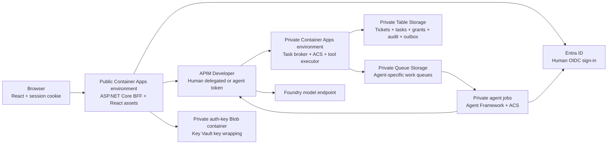

## Status and confirmed scope

Research and design only. No UI, API endpoint, or worker described here is
implemented. Framework versions, deployment resources, and cost meters need
validation during the implementation spikes.

The first MVP includes:

* A dashboard for seeded synthetic support tickets
* Ticket details and agent task submission
* An approval inbox with approve/reject actions
* Task progress and sanitized authorization history
* React with an ASP.NET Core backend-for-frontend (BFF), on one origin
* A public portal environment separate from the private gateway environment
* Requester self-approval for the single-user demo
* One portal replica, with re-sign-in after restart acceptable

Ticket creation, deletion, general editing, comments, attachments, arbitrary
chat, and direct human priority editing are excluded. A priority change must
still go through the agent/task/approval/execution workflow.

Public GitHub source does not imply anonymous access to the deployed portal.
The Azure MVP remains single-tenant and requires authorized Entra users.

## Frontend technology recommendation

| Component          | Recommendation                       | Purpose                                      |
|--------------------|--------------------------------------|----------------------------------------------|
| UI                 | React with TypeScript                | Typed ticket/task/approval components         |
| Build              | Vite                                 | Development tooling and a static asset build |
| Routing            | React Router                         | Tickets, tasks, approvals, and history pages  |
| Server state       | TanStack Query                       | Read caching, status polling, invalidation   |
| Components         | Material UI community/core components| Tables, dialogs, alerts, navigation, forms    |
| Backend            | ASP.NET Core on the selected .NET LTS| Authentication, typed BFF routes, API client  |
| Human identity     | Microsoft.Identity.Web               | OIDC sign-in and server-side delegated tokens|
| Frontend checks    | TypeScript, Vitest, Testing Library   | Types and component/interaction behavior     |
| Browser checks     | Playwright                           | Full browser flows and network assertions    |

Use ordinary Material UI tables rather than a paid grid edition. Use bundled
assets and system fonts initially. An accessible component library helps,
but does not establish accessibility compliance without testing.

React generally recommends a framework for new applications. A Vite SPA is
appropriate here because ASP.NET Core already owns authentication and the
backend, the UI is an authenticated dashboard, and there is no requirement
for React server rendering, search indexing, or React Server Components.
Revisit this decision if those requirements appear.

Build the React assets before ASP.NET publish and include the generated assets
in the web application's static-asset pipeline. Production runs one .NET
portal container, not a Vite development server or an additional Node server.
Pin dependencies and use a Node LTS satisfying the chosen Vite version.

Reserve `/bff` and `/auth` for backend routes. SPA navigation fallback must
never convert an unknown API route, API error, or OIDC callback into the React
HTML page with a misleading 200 response.

## Navigation and screens

### Ticket dashboard

Show ticket ID, subject, status, priority, and last updated time in a paginated
table. Add subject/ID search and priority/status filters. Sorting, filtering,
and pagination must have bounded backend parameters.

Human browsing uses a separately authorized human-read API, not an agent's
`tickets.read` grant. Record the human reader as a human. Browsing must not
consume a task grant or imply the selected agent is authorized.

### Ticket detail

Show the synthetic description and authoritative current priority. Include:

* Agent selector using server-enrolled aliases for agent A and agent B
* Operation selector: read/summarize or request a priority change
* Required target-priority dropdown for a priority change
* Optional bounded instructions, explicitly not a permission source
* A submit action showing the task deadline and required approval
* Recent task/decision history for the selected ticket

The selected target priority defines the authorized intent. The model cannot
choose an unrelated action or broaden scope from the instruction text.
The UI cannot edit policy, grant arbitrary expiry, or select a custom tool/URL.

### Task detail

Show the agent alias, ticket, requested operation, requester, server deadline,
current state, and sanitized result. Present a chronological decision timeline:
identity validation, task grant, ACS decision, pending approval, and execution.

Keep "requested", "approved", and "executed" visibly separate. A requested
priority is not the ticket's current priority. Do not optimistically change the
displayed ticket before the backend reports a committed outcome.

Include cancel for eligible tasks. Cancellation revokes unconsumed grants;
it cannot undo a committed write. If commit wins the race, show the completed
outcome rather than a false "cancelled successfully" message.

### Approval inbox and action review

Display only approvals the signed-in user is permitted to review. Before
approval, show ticket ID, old/new priority, agent, requester, task deadline,
policy version, and a human-readable summary of the exact action.

Bind the submitted approval to the server's pending action identifier,
argument digest, and resource version. The browser cannot provide an arbitrary
`approved=true` fact or approver identity.

The confirmation dialog must explicitly say that requester self-approval is
enabled for this demo. It is still a real authenticated human action, but
must not be described as separation of duties.

Deploy the self-approval mode as server-owned policy, not a browser checkbox.
The user must have both operator and approver permissions. A separate-human
mode is a future policy option, not an implemented default.

### Authorization history

Show sanitized records with identity alias, tool, resource scope, decision,
reason, approval reference, result, policy version, and correlation ID.
Distinguish authoritative gateway execution records from worker-reported
progress. A worker cannot manufacture an "executed successfully" audit result.

Use allow/deny/escalate labels as text, not only colors. Omit JWTs, grant
handles, raw prompts, raw policy snapshots, and private infrastructure values.

## Suggested layout

```text
+--------------------------------------------------------------------+
| Agent Gateway Lab       Tickets   Approvals   History       Account |
+---------------------------+----------------------------------------+
| Tickets                   | TICKET-003: Login issue                 |
| Search and filters        | Priority: Normal   Status: Open         |
|                           |                                        |
| TICKET-001  High           | Synthetic description                  |
| TICKET-002  Low            |                                        |
| TICKET-003  Normal         | Agent: Agent A                         |
|                           | Operation: Request priority change     |
|                           | Target priority: High                  |
|                           | [Submit agent task]                    |
+---------------------------+----------------------------------------+
| Task timeline: Grant issued -> Running -> Awaiting human approval   |
| Demo policy: requester self-approval is enabled                     |
+--------------------------------------------------------------------+
```

The layout is a design sketch, not a rendered prototype. On narrow screens,
use separate list/detail pages rather than compressing the table and form.
Provide keyboard navigation, labeled controls, dialog focus management, and
polite status announcements.

## Hosting and trust boundaries



There are two public entry points: the portal and the APIM API gateway. The
portal is not the tool executor. Every portal business request goes from the
BFF through APIM to the private gateway with a delegated user token.

Use separate dedicated Container Apps subnets in the VNet for the public
portal environment and private backend environment, alongside APIM and private
endpoint subnets. Confirm sizing, private DNS, and NSG requirements before
infrastructure generation.

The public environment has external accessibility and external app ingress.
The private environment has internal accessibility; its gateway app uses
external app ingress so APIM can reach the environment's internal load balancer.
On an internal environment, that setting means VNet access, not public internet
access. App-internal ingress would hide it from APIM outside the environment.

Do not expose the private gateway through an environment-level HTTP route to
make the React app reachable. The two-environment design preserves the backend
boundary without putting sign-in callbacks and cookie pages behind APIM's
agent JWT policy.

The BFF has no ticket/grant/audit Table access, no queue publishing rights,
no APIM transport identity, and no blueprint impersonation credential.
Its narrow infrastructure access is for its own authentication key ring.

## Human sign-in and browser protection

### Identity flow

1. The browser starts sign-in through a fixed BFF authentication route.
1. ASP.NET Core performs single-tenant OIDC authorization-code sign-in.
1. Microsoft.Identity.Web acquires gateway API tokens for the signed-in human.
1. The BFF calls fixed APIM routes using those delegated tokens.
1. APIM and the gateway validate the human subject, BFF client, scope, role, and resource access.

The human flow is separate from the Agent ID autonomous flow. A user clicking
"Run agent" does not become an agent token. Store requester identity on the
task, then let the assigned worker acquire its own child Agent ID token.
Do not send a human bearer token to the worker or queue.

Use a distinct BFF app registration and a user-assigned managed identity
federated to it. Microsoft.Identity.Web supports
`SignedAssertionFromManagedIdentity` for Azure-hosted confidential clients.
This credential proves the BFF application; it does not replace the human's
delegated permission. Configure and test this separately from blueprint FIC.

For local development, use a separately configured developer credential
outside source control. A managed identity endpoint is not present on a
normal laptop. Never place a secret in a `VITE_` setting or frontend bundle.

### Session and request rules

* Give the browser a Secure, HttpOnly, host-scoped authentication cookie.
* Keep access/refresh tokens in the server token cache, not browser storage or a serialized authentication cookie.
* Leave token saving to cookies disabled; test that OAuth tokens do not reach browser responses.
* Preserve appropriate OIDC nonce/correlation-cookie settings; blanket `SameSite=Strict` can break sign-in callbacks.
* Validate ASP.NET antiforgery tokens explicitly on cookie-authenticated JSON mutations, including approve, reject, cancel, and logout.
* Use POST for state changes, with local-only validated post-login return paths.
* Keep the authentication callback exact, with trusted host and forwarded-header configuration.
* Apply no-store caching to session, ticket, task, approval, and history responses.
* Render ticket/model text as text; do not use untrusted HTML or unsanitized Markdown.
* Configure CSP/frame protection compatible with the component library; do not disable security to fix styling.
* Use an explicit fixed upstream route map, never a generic browser-controlled proxy URL.

The antiforgery token can be held in React memory; it is not an API bearer
token. Same-origin hosting and SameSite cookies do not remove the need for CSRF
validation. CORS is not authorization, and this design requires no permissive
production CORS policy.

Known BFF API endpoints must return JSON 401/403 responses, not a login HTML
page inside `fetch`. React handles reauthentication through a deliberate
top-level navigation. Distinguish sign-in required, role denied, expired task,
stale action, throttling, and dependency failure.

### Cache and key persistence

Use Microsoft's in-memory user-token cache for this accepted demo constraint:
one replica, one active revision, no traffic splitting, and re-sign-in after
restart or token-cache loss. Do not call it a shared or persistent token cache.
Make reauthentication explicit and do not automatically replay a mutation.

Persist ASP.NET Data Protection keys to a private Blob container with managed
identity, and protect them with a Key Vault key. Keep access scoped to the BFF's
key container and wrapping key. Agents cannot read that key ring.

The Blob key ring preserves cookie/antiforgery cryptographic keys, not the MSAL
token cache. Tickets, approvals, and tasks remain durable in the gateway ledger.
After re-sign-in, the user can reopen them without creating another task.

Adding replicas or requiring seamless sign-in across restarts requires an
encrypted distributed token cache and shared key configuration. Do not
silently scale this in-memory design into that deployment.

## Proposed API contracts

These are design contracts, not implemented endpoints. BFF routes map to
fixed gateway human routes. The browser cannot call the agent-only routes.

| Route family                         | Access and behavior                                      |
|--------------------------------------|----------------------------------------------------------|
| `/auth/login`, OIDC callback          | Fixed sign-in flow; no business mutation                  |
| `/bff/session`, `/bff/antiforgery`     | Session capabilities and CSRF bootstrap; no OAuth tokens  |
| `GET /bff/tickets`                    | Authorized human browsing; bounded filter/page inputs     |
| `GET /bff/tickets/{id}`               | Human detail read, independently resource-authorized       |
| `POST /bff/tasks`                     | Operator intent submission; idempotent acceptance         |
| `GET /bff/tasks/{id}`                 | Authorized status/result; no grant handles                |
| `POST /bff/tasks/{id}/cancel`          | Operator-controlled cancellation, with race-safe outcome   |
| `GET /bff/approvals`                  | Only reviewable pending actions                          |
| `POST /bff/approvals/{id}/approve`    | Approver, exact action/version, CSRF, idempotency           |
| `POST /bff/approvals/{id}/reject`     | Approver rejection with the same protections              |
| `GET /bff/history`                    | Resource-scoped sanitized durable records                 |
| `POST /bff/logout`                    | CSRF-protected session end and frontend cache clearing    |
| `/agent/tasks/{id}/claim` and context | Only assigned child principal; leased work/context access |
| Agent proposal/progress routes       | Typed, assigned-agent-only reports; not execution proof   |
| Agent tool invocation route          | Existing final ACS/grant/approval boundary                 |

Human API access requires a narrow delegated scope, such as `Gateway.Access`,
and resource API roles:

| Role             | Allowed human actions                                  |
|------------------|--------------------------------------------------------|
| `Ticket.Viewer`   | Read authorized synthetic tickets                      |
| `Task.Operator`  | Submit/read/cancel permitted tasks                      |
| `Task.Approver`  | Review and decide permitted pending actions              |
| `Audit.Reader`   | Inspect sanitized history within assigned scope         |

Assign the single demo user the roles needed for the demonstration. Agent
app-only tokens have none of these human privileges. The UI uses capabilities
returned by the gateway; hiding buttons is not enforcement. The API must check
roles and resource ownership/workspace scope on every request.

For task submission, send ticket ID, enrolled agent selection, operation,
target priority when needed, bounded instructions, and an idempotency key.
Derive requester, allowed tools, expiry, approval policy, and principal binding
server-side. Reject unexpected privilege-bearing properties.

Return 202 only after intent, grants, and durable dispatch intent are stored.
Include a status reference and retry guidance. The BFF maps this to its own
same-origin status URL rather than exposing an arbitrary upstream `Location`.
Accepted means queued, not executed.

Use version preconditions for decisions. A stale action/ticket produces an
explicit conflict; an invalid or expired grant produces a deny. Do not extend
the task's deadline as a side effect of polling, signing in, or approving.

## Durable task execution and approval resume

Do not keep the model running inside the BFF request or use a fire-and-forget
task that disappears when the web process restarts.

Use the trusted gateway ledger, a transactional outbox, agent-specific Azure
Storage queues, and event-driven Container Apps jobs:

1. The gateway atomically stores the task, constrained grants, and outbox dispatch intent in its Table partition.
1. A trusted dispatcher publishes an ID/version/stage work message and marks the outbox record dispatched.
1. A worker uses its configured child identity to claim that task through APIM.
1. The worker obtains authorized context; the queue contains no bearer tokens, prompts, or grant handles.
1. Agent Framework and ACS perform the read/proposal workflow.
1. A sensitive proposal is stored as an exact pending action; the job exits rather than waiting for a person.
1. A human decision atomically updates the pending action and creates resume-dispatch intent.
1. A new job reconstructs the approved action/context and passes final gateway enforcement before mutation.

The outbox and queue publish are not one cross-service transaction. Publication
can occur more than once after a crash. Use message versions/stages, task leases,
ETags, and existing tool idempotency to make redelivery safe.
Keep the trusted dispatcher active while task work is enabled; if hosted with
the private gateway, use at least one gateway replica rather than allowing
undispatched outbox records to depend on an unrelated future HTTP request.

Store minimal resume context and its policy/action identity in the private
ledger. ACS itself is stateless. A resume must not rerun the completed mutation,
blindly rerun a consumed read grant, or ask the model to replace approved
arguments. Execution truth comes from the gateway's committed record.

Use identity-authenticated queue access and scaling, not the tutorial's storage
connection string. Scope worker-host queue permissions to its assigned queue;
they do not grant access to the ticket/grant Table or auth-key Blob container.
The scaler needs queue visibility and the worker needs message processing.
Verify the exact scale-rule identity/API and role requirements in the spike.

The browser and BFF need no `Microsoft.App/jobs/start/action` permission.
Job start permission is powerful: an execution template can override code
and exercise job secrets/available identities. Use fixed, trusted event-job
definitions and keep job configuration rights outside the portal.

### State and expiry

```text
queued -> running -> awaiting_approval -> resume_queued -> running -> succeeded
                  -> denied / failed
awaiting_approval -> rejected / expired / cancelled
queued or running -> expired / cancelled / failed
committed write with blocked output -> completed_output_blocked
```

Terminal state transitions must be checked against stored execution results.
Cancellation racing a commit may result in a completed action, not a rollback.
Approval waiting and queue delays consume the task's maximum 300-second lifetime.
An expired task requires a new explicit task and authorization; it is not
automatically revived.

## Frontend data and error behavior

Poll active task status initially every two seconds, with server retry guidance,
backoff on throttling, no retry for 401/403, and no polling of completed or hidden
views. Do not request grant or approval renewal while polling.

Configure TanStack Query deliberately. Its default stale-data refetches and
three query retries are inappropriate for some auth/expiry responses.
Disable automatic mutation retry. If a response is lost, query the task/action
or reuse the same idempotency key with a user-visible recovery path.

Invalidate ticket and approval queries after a confirmed outcome. Clear all
user-specific query data on sign-out or account change. Do not persist private
query data to local storage or add an offline service-worker cache in the MVP.

Show loading, empty, error, stale-data, pending-approval, and terminal states
distinctly. Never convert an unavailable API into an empty successful ticket
list or a rejected action into a green success notification.

## Implementation order and cost impact

1. Spike the real React/BFF sign-in, delegated API token, antiforgery, and restart flow.
1. Build ticket list/detail screens with typed fixtures clearly labeled as fixtures.
1. Integrate the human-read API and real resource authorization.
1. Implement durable submission, outbox, worker claim, and status polling.
1. Implement the exact-action approval screen and resumable execution.
1. Add history, cancellation, errors, accessibility, and full browser tests.
1. Run the real Azure demo and sanitize publication artifacts.

The UI adds a public BFF workload, a second environment/subnet, auth-key Blob
access, queue dispatch, and associated DNS/endpoints/telemetry. Some components
reuse the existing VNet, vault, and monitoring; not all private endpoint costs
can be assumed shared because Blob, Table, and Queue are different subresources.

Reserve an additional **US$20-50/month** as an unverified light-demo allowance.
The revised overall planning band is **US$110-200/month**, excluding identity
licenses and taxes. Only the earlier APIM Developer meter is verified.
Single active portal/dispatcher replicas, logs, and model volume must be priced
before approving a spending ceiling.

## Sources and interpretation

Sources reviewed on 2026-10-08. Recommendations and API names above are this
project's design, not a Microsoft-provided complete application template.

* [React: building an app from scratch and framework tradeoffs](https://react.dev/learn/build-a-react-app-from-scratch)
* [Material UI overview](https://mui.com/material-ui/getting-started/)
* [TanStack Query defaults](https://tanstack.com/query/latest/docs/framework/react/guides/important-defaults)
* [Microsoft.Identity.Web: web apps calling downstream APIs](https://learn.microsoft.com/en-us/entra/msidweb/call-downstream-apis/from-web-apps)
* [Certificateless web app authentication](https://learn.microsoft.com/en-us/entra/msidweb/authentication/certificateless)
* [Token cache strategies and restart limitations](https://learn.microsoft.com/en-us/entra/msidweb/authentication/token-cache-overview)
* [ASP.NET Core antiforgery](https://learn.microsoft.com/en-us/aspnet/core/security/anti-request-forgery?view=aspnetcore-10.0)
* [Cookie authentication and API 401/403 behavior](https://learn.microsoft.com/en-us/aspnet/core/security/authentication/cookie?view=aspnetcore-10.0)
* [Data Protection with Blob Storage and Key Vault](https://learn.microsoft.com/en-us/aspnet/core/security/data-protection/configuration/overview?view=aspnetcore-10.0)
* [ASP.NET Core static assets](https://learn.microsoft.com/en-us/aspnet/core/fundamentals/static-files?view=aspnetcore-10.0)
* [Same origin and CORS limitations](https://learn.microsoft.com/en-us/aspnet/core/security/cors?view=aspnetcore-10.0)
* [Container Apps ingress and environment visibility](https://learn.microsoft.com/en-us/azure/container-apps/ingress-overview)
* [Container Apps networking](https://learn.microsoft.com/en-us/azure/container-apps/networking)
* [Asynchronous request-reply pattern](https://learn.microsoft.com/en-us/azure/architecture/patterns/asynchronous-request-reply)
* [Container Apps jobs and privilege boundaries](https://learn.microsoft.com/en-us/azure/container-apps/jobs)
* [Event-driven job tutorial, including queue handling](https://learn.microsoft.com/en-us/azure/container-apps/tutorial-event-driven-jobs)
* [Managed identity for Azure queue scaling](https://learn.microsoft.com/en-us/azure/container-apps/scale-app#authentication)
* [Azure Queue Storage](https://learn.microsoft.com/en-us/azure/storage/queues/storage-queues-introduction)
* [Table Storage transaction constraints](https://learn.microsoft.com/en-us/rest/api/storageservices/performing-entity-group-transactions)

See the [main research plan](./research-and-build-plan.md) for identity/ACS
sources and the [acceptance tests](./acceptance-tests.md) for verification.
